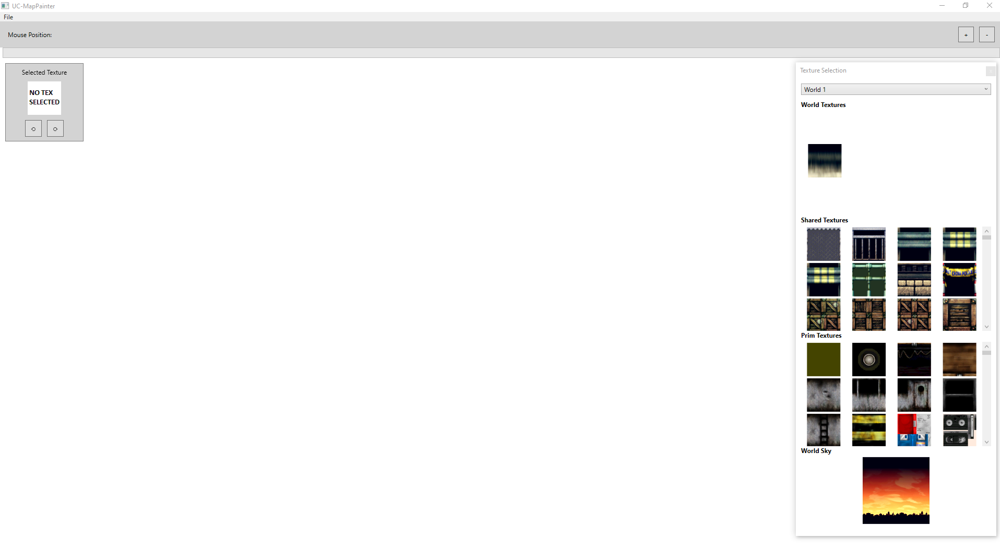
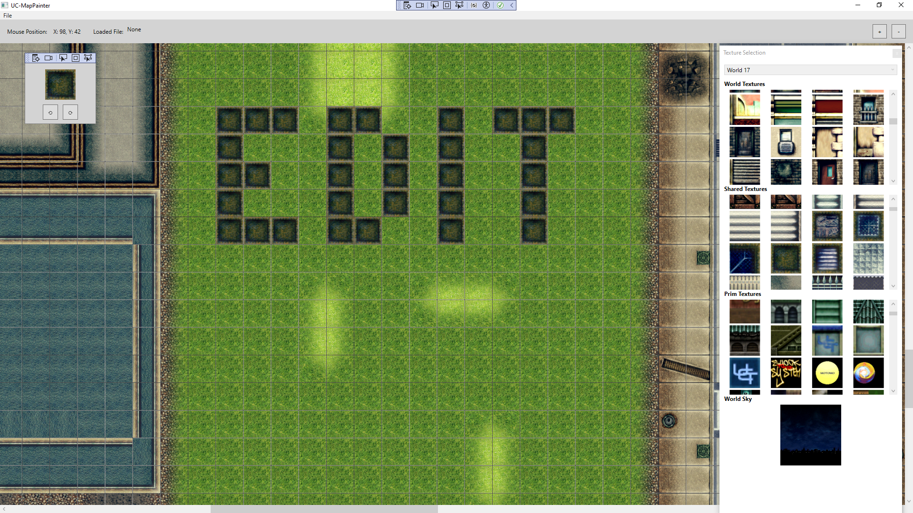
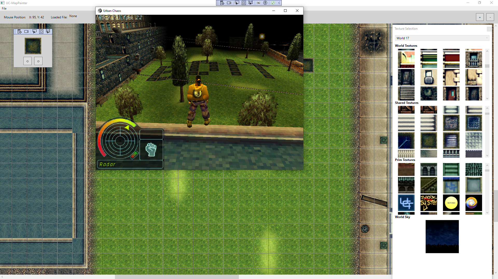

# UC-MapPainter

## Overview
UC-MapPainter is an application used for creating, modifying, and exporting the textures of Urban Chaos map files (.iam files). It loads map files onto a grid and allows cell-by-cell texture editing. All files required to run the application are included.

## Features
- **Create New Maps**: Generate new maps using a default world template.
- **Load Maps**: Directly load .iam files with automatic texture recognition.
- **Zoom and Coordinate Tracking**: Zoom in/out functionality and real-time cell coordinate tracking.
- **Export Maps**: Export the maps to an 8192 x 8192 pixel image file.
- **Save Maps**: Save maps back to .iam format for use in the Urban Chaos game.

## Getting Started
To get started with UC-MapPainter, simply clone the repository and build the application. No additional requirements are necessary.

1. Clone the repository
2. Build and run the application

## Usage
- **Create New Map**: Select "New Map" from the File menu to generate a blank map. You will be prompted to select a world (style) for the map. Choose carefully, as this selection will be locked.
- **Load Map**: Use the "Load Map" option from the File menu to load an existing .iam file. The application will automatically detect the world (if available). If a world is not detected, you will be prompted to enter one.
- **Select Textures**: Once the grid is loaded, select textures to paint with from the right-hand side. The selected texture box will update accordingly. Rotate the texture using the buttons underneath the selected texture.
- **Zoom**: Use the Zoom In/Zoom Out buttons to view higher resolution maps (use sparingly to avoid performance issues).
- **Save Map**: When satisfied with the paint job, save back to a .iam file using the "Save Map" option. You can also export the map file to an image.

## Screenshots

## Acknowledgements
- **Urban Chaos Discord**: [Urban Chaos Discord](https://discord.gg/EhFGnWWagx)
- **Pieroz**: Special thanks to [Pieroz](https://github.com/PieroZ) for breathing life into Urban Chaos modding.
- **Inco1**: [Inco1](https://github.com/inco1/) - The PHP tools he created served as the basis for understanding .iam files.

## Contributing
Contributions to UC-MapPainter are welcome. Please feel free to fork the repository, make your changes, and submit a pull request.

## License
This project is licensed under the MIT License - see the [LICENSE.txt](LICENSE.txt) file for details.
